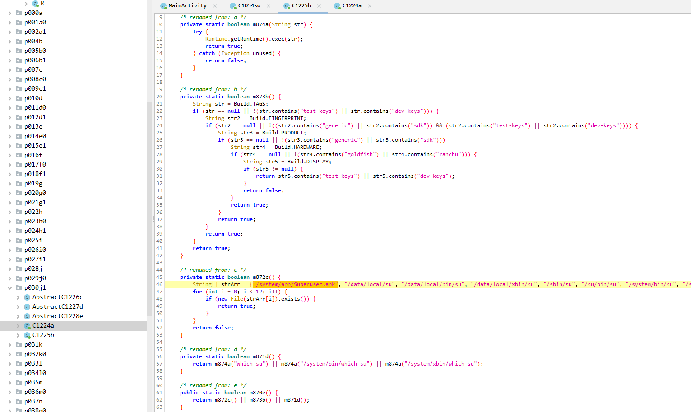

# TISC 2023 - Writeups
Solved 6 levels of TISC 2023 and got stuck at flag part 2 of Level 7 (DevSecMeow) sadly :( skill issue


Todo writeups! <br /><br />

Level 1: Disk Archaeology (Forensics)

Level 2: XIPHEREHPIX’s Reckless Mistake (Crypto)

Level 3: KPA (Mobile)

Level 4: Really Unfair Battleships Game (Pwn, Misc)

Level 5: PALINDROME’s Invitation (OSINT, Misc)

Level 6B: The Chosen Ones (Web) <br /><br />

# Level 1: Disk Archaeology

> Unknown to the world, the sinister organization PALINDROME has been crafting a catastrophic malware that threatens to plunge civilization into chaos. Your mission, if you choose to accept it, is to infiltrate their secret digital lair, a disk image exfiltrated by our spies. This disk holds the key to unraveling their diabolical scheme and preventing the unleashing of a suspected destructive virus.   
> 
>You will be provided with the following file:  
> - md5(challenge.tar.xz) = 80ff51568943a39de4975648e688d6a3  
>  
>  Notes:  
>  - challenge.tar.xz decompresses into challenge.img  
>  - FLAG FORMAT is TISC{some text you have to find}
>  
>   Attached Files
>   challenge.tar.xz

Extract the tar and we get a `challenge.img`

```python
┌──(wayell㉿wayell)-[~/Desktop/CTF/2023/TISC2023/1]
└─$ file challenge.img
challenge.img: Linux rev 1.0 ext4 filesystem data, UUID=2b4fee55-fd5f-483c-a85f-856944731f0f (extents) (64bit) (large files) (huge files)
```

Open up in autopsy and explore the filesystem. While exploring, there is a deleted ELF file. The strings in the file hints to parts of the flag: TISC{w4s_th3r3_s0m3th1ng_l3ft_%s}


We probably have to run this file or do some static analysis to get the rest of the flag.

But wait! We can’t actually run it yet. The binary requires `ld-musl-x86_64.so.1` interpreter, which after some searching, is part of the Alpine Linux: [https://pkgs.alpinelinux.org/contents?branch=edge&name=musl&arch=x86_64&repo=main](https://pkgs.alpinelinux.org/contents?branch=edge&name=musl&arch=x86_64&repo=main)

```python
┌──(wayell㉿wayell)-[~/Desktop/CTF/2023/TISC2023/1]
└─$ ./f0000008.elf 
bash: ./f0000008.elf: cannot execute: required file not found

┌──(wayell㉿wayell)-[~/Desktop/CTF/2023/TISC2023/1]
└─$ ldd f0000008.elf                                                                                                                                                                       
        linux-vdso.so.1 (0x00007fffeca09000)
        libc.musl-x86_64.so.1 => not found

┌──(wayell㉿wayell)-[~/Desktop/CTF/2023/TISC2023/1]
└─$ file f0000008.elf                                                                                                                                                                      
f0000008.elf: ELF 64-bit LSB pie executable, x86-64, version 1 (SYSV), dynamically linked, interpreter /lib/ld-musl-x86_64.so.1, with debug_info, not stripped
```

Using `apt-find` you can actually find the package that contains the library. This gave me the interpreter which i needed to execute the binary and get the flag.

```python
┌──(wayell㉿wayell)-[~/Desktop/CTF/2023/TISC2023/1]
└─$ sudo apt-file find ld-musl-x86_64.so.1
musl: /lib/ld-musl-x86_64.so.1
┌──(wayell㉿wayell)-[~/Desktop/CTF/2023/TISC2023/1]
└─$ sudo apt install musl
┌──(wayell㉿wayell)-[~/Desktop/CTF/2023/TISC2023/1]
└─$ ./f0000008.elf 
TISC{w4s_th3r3_s0m3th1ng_l3ft_ubrekeslydsqdpotohujsgpzqiojwzfq}
```

# Level 2: XIPHEREHPIX’s Reckless Mistake

> Our sources told us that one of PALINDROME's lieutenants, XIPHEREHPIX, wrote a special computer program for certain members of PALINDROME. We have somehow managed to get a copy of the source code and the compiled binary. The intention of the program is unclear, but we think encrypted blob inside the program could contain a valuable secret.
> 
>   Attached Files
>   prog.c
>   XIPHEREHPIX

Running the binary, we can see that it asks for a password that is more than 40 characters long, which we do not have.

```python
┌──(wayell㉿wayell)-[~/Desktop/CTF/2023/TISC2023/2]
└─$ ./XIPHEREHPIX 
Hello PALINDROME member, please enter password:
The password should be at least 40 characters as per PALINDROME's security policy.

┌──(wayell㉿wayell)-[~/Desktop/CTF/2023/TISC2023/2]
└─$ ./XIPHEREHPIX 
Hello PALINDROME member, please enter password:
Failure!
```


The source code is provided as part of the challenge files. Rough description of the different functions:

**`main()`**

- Requests for a password that is at least 40 characters
- Checks our password against `verify_password()`
- Runs `initialise_key()` followed by `show_welcome_message()` with the key that was generated

```python
int main(int argc, char **argv)
{
    char password[MAX_PASSWORD_SIZE + 1] = { 0 };
    int password_length;

    unsigned char key[32];

    printf("Hello PALINDROME member, please enter password:");

    password_length = input_password(password);
    if (password_length < 40) {
        printf("The password should be at least 40 characters as per PALINDROME's security policy.\n");
        exit(0);
    }

    if (!verify_password(password, password_length)) {
        initialise_key(key, password, password_length);
        show_welcome_msg(key);
    }
        
    else {
        printf("Failure! \n");
        exit(0);
    }
}
```

`verify_password()`

- Compares our password against a SHA256 hash `962fe02a147163af8003eb5b7ff756523220981f9f027e35fb933faadd7944b7`
- This probably can’t be bruteforced or guessed, since the password length is minimally 40 characters.
- If the password provided by the user matches the hash, then returns 0 (due to memcmp)

```python
int verify_password(char *password, int password_length) {
    unsigned char mdVal[EVP_MAX_MD_SIZE];
    unsigned int i;

    calculate_sha256(mdVal, password, password_length);

    uint64_t hash[] = { 0x962fe02a147163af,
                        0x8003eb5b7ff75652,
                        0x3220981f9f027e35,
                        0xfb933faadd7944b7};

    return memcmp(mdVal, hash, 32);
}
```

`initialise_key()` and `accumulate_xor()`

- Seed is initialized as "PALINDROME IS THE BEST!", which is used later in the first `calculate_sha256` call
- Creates an array `arr` of 20 elements, each with a size of 256 bits (due to uint256_t)
- The first element of the array is the SHA256 hash of our seed, and the subsequent elements are the SHA256 hash of the element preceding it.
    - First element arr[0]: SHA256("PALINDROME IS THE BEST!")
    - Second element: SHA256(arr[0])
    - Third element: SHA256(arr[1])
    - and so on…
- Loops through each character in our password and subsequenty each bit in the password (in the for (j = 0; j < 8; j++) { loop)
    - `counter` is set so that for each iteration of the bitloop, it’ll go through the next element of the array (so first iter select arr[0], next select arr[1] and so on, until it goes back to arr[0])
    - If the current bit in `ch` we are comparing is 0, no operation will be made
    - however, if the current bit in `ch` is 1, this runs the `accumulate_xor()`
        - which would just XOR the current key256 (which initially is set to 0s) with the selected arr element (based on counter)

```python
void initialise_key(unsigned char *key, char *password, int password_length) {
    const char *seed = "PALINDROME IS THE BEST!";
    int i, j;
    int counter = 0;

    uint256_t *key256  = (uint256_t *)key;

    key256->a0 = 0;
    key256->a1 = 0;
    key256->a2 = 0;
    key256->a3 = 0;

    uint256_t arr[20] = { 0 };

    calculate_sha256((unsigned char *) arr, (unsigned char *) seed, strlen(seed));

    for (i = 1; i < 20; i++) {
        calculate_sha256((unsigned char *)(arr+i), (unsigned char *) (arr+i-1), 32);
    }

    for (i = 0; i < password_length; i++) {
        int ch = password[i];
        for (j = 0; j < 8; j++) {
            counter = counter % 20;

            if (ch & 0x1) {
                accumulate_xor(key256, arr+counter);
            }

            ch = ch >> 1;
            counter++;
        }
    }
}

void accumulate_xor(uint256_t *result, uint256_t *arr_entry) {
    result->a0 ^= arr_entry->a0;
    result->a1 ^= arr_entry->a1;
    result->a2 ^= arr_entry->a2;
    result->a3 ^= arr_entry->a3;

}
```

`show_welcome_msg()`

- AES-GCM implementation to decrypt the ciphertext
- iv, tags etc are all known/fixed, which isn’t an ideal implementation
- However without knowledge of the correct key, we’re unable to really attack this implementation

```python
void show_welcome_msg(unsigned char *key) {
    int plaintext_length;
    unsigned char *iv = "PALINDROME ROCKS";
    
    unsigned char plaintext[128] = { 0 };
    const unsigned char * const header = "welcome_message";
    unsigned char ciphertext[] =
        "\xad\xac\x81\x20\xc6\xd5\xb1\xb8\x3a\x2a\xa8\x54\xe6\x5f\x9a\xad"
        "\xa4\x39\x05\xd9\x21\xae\xab\x50\x98\xbd\xe4\xc8\xe8\x2a\x3c\x63"
        "\x82\xe3\x8e\x5d\x79\xf0\xc6\xf4\xf2\xe7";

    unsigned char tag[] =
        "\xbd\xfc\xc0\xdb\xd9\x09\xed\x66\x37\x34\x75\x11\x75\xa2\x7a\xaf";

    plaintext_length = gcm_decrypt(ciphertext, 
                42,
                (unsigned char *)header,
                strlen(header),
                tag,
                key, 
                iv,
                16,
                plaintext);

    printf("Welcome PALINDROME member. Your secret message is %.*s\n", plaintext_length, plaintext);
}
```

From here, we can get the rough idea on how we can solve the challenge. The weakness lies in the `initialize_key` implementation, which essentially reduces the keyspace size to 2^20 due to the commutative properties of XOR. We’re not interested in the possible passwords anymore, but instead the possible keys that could have been used in the decryption function. We can do a keyspace brute force which allows us to recover the flag.


To solve this, we change the main function as follows. This will just test the `show_welcome_message` against every single possible key. Also do note that the size has been passed in as 3 bytes, as we’re trying to brute force 20 bits, essentially taking up 3 bytes. 


2^20 equates to 1048576, alternatively we can also use `i < (1 << 20)` instead of `i < 1048576`

```python
int main(int argc, char **argv)
{
    char password[MAX_PASSWORD_SIZE + 1] = { 0 };
    int password_length;

    unsigned char key[32];

    printf("Hello PALINDROME member, please enter password:");

    for(int i = 0; i < 1048576; i++) {
        unsigned char * bruteKey = (unsigned char *)&i;
        initialise_key(key, bruteKey, 3);
        show_welcome_msg(key);
    }
}
```


Compile and run the program, we can grep for the flag format and get our flag:

```python
┌──(wayell㉿wayell)-[~/Desktop/CTF/2023/TISC2023/2]
└─$ gcc solve.c -o solve -lcrypto

┌──(wayell㉿wayell)-[~/Desktop/CTF/2023/TISC2023/2]
└─$ ./solve | grep TISC
Welcome PALINDROME member. Your secret message is TISC{K3ysP4ce_1s_t00_smol_d2g7d97agsd8yhr}
```

# Level 3: KPA

> We've managed to grab an app from a suspicious device just before it got reset! The copying couldn't finish so some of the last few bytes got corrupted... But not all is lost! We heard that the file shouldn't have any comments in it! Help us uncover the secrets within this app!
> 
>   Attached Files
>   kpa.apk

The challenge description hints to the last bytes of the file being corrupted. 

Apk files are pretty much zip files. We can look up the file structure of a zip file, and towards the end of the zip file there is an End of Central Directory record.

[https://users.cs.jmu.edu/buchhofp/forensics/formats/pkzip.html](https://users.cs.jmu.edu/buchhofp/forensics/formats/pkzip.html)


When we look at the EOCD record in our apk, we can find that the comment len is indicated as 0a instead of 00 bytes long. There are no comments in the file based on the challenge description, which is also seen as the apk file ends with 00s indicating no comments.

Changing the second last byte of our apk from 0a to 00 will fix it.

```bash
┌──(wayell㉿wayell)-[/tmp]
└─$ hd kpa.apk | tail -n 5
002b0d20  67 6f 6f 67 6c 65 2e 61  6e 64 72 6f 69 64 2e 6d  |google.android.m|
002b0d30  61 74 65 72 69 61 6c 5f  6d 61 74 65 72 69 61 6c  |aterial_material|
002b0d40  2e 76 65 72 73 69 6f 6e  50 4b 05 06 00 00 00 00  |.versionPK......|
002b0d50  d0 02 d0 02 7d bc 00 00  cb 50 2a 00 00 00        |....}....P*...|
002b0d5e
```

Now we can decompile the apk with any preferred tool, after a cursory glance, we find the main logic of the code, in MainActivity.


The code basically checks for whether the text after going through SHA1 1024 times.

```java
package com.tisc.kappa;
...
/* access modifiers changed from: private */
    public void M(String str) {
        char[] charArray = str.toCharArray();
        String valueOf = String.valueOf(charArray);
        for (int i2 = 0; i2 < 1024; i2++) {
            valueOf = N(valueOf, "SHA1");
        }
        if (!valueOf.equals("d8655ddb9b7e6962350cc68a60e02cc3dd910583")) {
            ((TextView) findViewById(d.f3935f)).setVisibility(4);
            Q(d.f3930a, 3000);
            return;
        }
```

We can run the app and do dynamic analysis instead, but it has some security checks in the MainActivity which calls other functions (from the j1 package) that checks if the device is from an emulator. When running the app in an emulator, the check would fail.


If we examine the code, we can actually bypass this with frida.

Corresponding snippets from the apk code that implement the emulator detection checks:

But a very brief summary is as follows,

- j1.a: checks the presence of apps and returns a counter of number of apps installed based on their strArr list, if the counter is 20 then the check will pass
- j1.b: checks for root detection which is common in android emulators, if the result from this is false, then the check has passed




We can use frida to hook the functions, and make them return the values we want. First upload and run frida-server

```python
C:\Users\wayel\Downloads\l3>adb push frida-server-x64 /data/local/tmp/frida-server
frida-server-x64: 1 file pushed, 0 skipped. 26.3 MB/s (108171000 bytes in 3.924s)

C:\Users\wayel\Downloads\l3>adb shell
vbox86p:/ # cd /data/local/tmp
vbox86p:/data/local/tmp # chmod +x frida-server
vbox86p:/data/local/tmp # ./frida-server
```


Frida script that we can use hook the functions to set the return values we want.


Corresponding checker logic in MainActivity:

`if (C1224a.m876a(packageManager) == 20) {`

`if (C1225b.m870e()) {m1515P("Suspicious device detected!", "CHECK FAILED", "BYE");}`

```jsx
Java.perform(function () {
	var pass1 = Java.use("j1.a");
    pass1.a.implementation = function () {
        return 20;
    };
    var pass2 = Java.use("j1.b");
    pass2.e.implementation = function () {
        return false;
    }; 
	console.log("Bypassed, check app")  
});
```

When we run the app using frida and our bypass script, it presents us with a page to submit a secret. But we don’t have the secret though?

```bash
C:\Users\wayel\Downloads\l3>frida -U -l bypass1.js -f com.tisc.kappa
     ____
    / _  |   Frida 16.0.8 - A world-class dynamic instrumentation toolkit
   | (_| |
    > _  |   Commands:
   /_/ |_|       help      -> Displays the help system
   . . . .       object?   -> Display information about 'object'
   . . . .       exit/quit -> Exit
   . . . .
   . . . .   More info at https://frida.re/docs/home/
   . . . .
   . . . .   Connected to Nexus 6P (id=192.168.22.105:5555)
Spawned `com.tisc.kappa`. Resuming main thread!
[Nexus 6P::com.tisc.kappa ]-> Bypassed, check app
```


After searching around further in the code, i found this in one of the files which loads a library and sets a property KAPPA in the css(). As there were no other indicators of what could be the secret, I figured this was probably the key we were looking for.

[https://www.javatpoint.com/post/java-system-setproperty-method](https://www.javatpoint.com/post/java-system-setproperty-method)

```java
package com.tisc.kappa;

/* renamed from: com.tisc.kappa.sw */
public class C1054sw {
    static {
        System.loadLibrary("kappa");
    }

    /* renamed from: a */
    public static void m5575a() {
        try {
            System.setProperty("KAPPA", css());
        } catch (Exception unused) {
        }
    }

    private static native String css();
}
```

In frida, we can attempt to get the contents of this property with the following:

```jsx
var system = Java.use("java.lang.System");
console.log(system.getProperty("KAPPA"));
```

This actually prints a string `ArBraCaDabra?KAPPACABANA!` which seems to be the secret we are looking for!

```python
[Nexus 6P::com.tisc.kappa ]-> var system = Java.use("java.lang.System");
console.log(system.getProperty("KAPPA"));
ArBraCaDabra?KAPPACABANA!
```


This happens to be the password input, as if we hash it 1024 times, it gives us the same identical hash as the one we identified in our initial analysis:

```python
>>> import hashlib
>>> 
>>> def repeated_sha1(message, times):
...     for _ in range(times):
...         message = hashlib.sha1(message.encode()).hexdigest()
...     return message
... 
>>> message = "ArBraCaDabra?KAPPACABANA!"
>>> hashed_message = repeated_sha1(message, 1024)
>>> assert hashed_message == 'd8655ddb9b7e6962350cc68a60e02cc3dd910583'
>>> print("Found")
Found
```

Entering the string into the app gives us the flag

```python
TISC{C0ngr@tS!us0lv3dIT,KaPpA!}
```


# Level 4: Really Unfair Battleships Game

> After last year's hit online RPG game "Slay The Dragon", the cybercriminal organization PALINDROME has once again released another seemingly impossible game called "Really Unfair Battleships Game" (RUBG). This version of Battleships is played on a 16x16 grid, and you only have one life. Once again, we suspect that the game is being used as a recruitment campaign. So once again, you're up!
>
> Things are a little different this time. According to the intelligence we've gathered, just getting a VICTORY in the game is not enough.
>
> PALINDROME would only be handing out flags to hackers who can get a FLAWLESS VICTORY.
>
> You are tasked to beat the game and provide us with the flag (a string in the format TISC{xxx}) that would be displayed after getting a FLAWLESS VICTORY. Our success is critical to ensure the safety of Singapore's cyberspace, as it would allow us to send more undercover operatives to infiltrate PALINDROME.
>
> Godspeed!
>
> You will be provided with the following:
>
> 1) Windows Client (.exe)
    - Client takes a while to launch, please wait a few seconds.
    - If Windows SmartScreen pops up, tell it to run the client anyway.
    - If exe does not run, make sure Windows Defender isn't putting it on quarantine.
>
> 2) Linux Client (.AppImage)
    - Please install fuse before running, you can do "sudo apt install -y fuse"
    - Tested to work on Ubuntu 22.04 LTS
> 
>   Attached Files
>   rubg-1.0.0.AppImage
>   rubg_1.0.0.exe

The game .exe is an archive which we can extract.

```jsx
┌──(wayell㉿wayell)-[~/Desktop/CTF/2023/TISC2023/4]
└─$ file rubg_1.0.0.exe                  
rubg_1.0.0.exe: PE32 executable (GUI) Intel 80386, for MS Windows, Nullsoft Installer self-extracting archive, 5 sections
```

Extracting the archive, we get a $PLUGINSDIR which contains an another archive which contains an app.asar. This confirms that it is a electron application, which we can then extract the source code.

```bash
┌──(wayell㉿wayell)-[~/Desktop/CTF/2023/TISC2023/4]
└─$ cd '$PLUGINSDIR'
                                                                                                                                                                                             
┌──(wayell㉿wayell)-[~/Desktop/CTF/2023/TISC2023/4]
└─$ ll                                               
total 68324
-rw-r--r-- 1 kali kali 69413654 Jul 17 11:39 app-64.7z
-rw-r--r-- 1 kali kali   434176 Oct  8 23:06 nsis7z.dll
-rw-r--r-- 1 kali kali   102400 Oct  8 23:06 StdUtils.dll
-rw-r--r-- 1 kali kali    12288 Oct  8 23:06 System.dll

┌──(wayell㉿wayell)-[~/Desktop/CTF/2023/TISC2023/4]
└─$ 7z x app-64.7z

┌──(wayell㉿wayell)-[~/Desktop/CTF/2023/TISC2023/4]
└─$ ll resources                  
total 12836
-rw-r--r-- 1 kali kali 13031793 Jul 17 11:39 app.asar
-rw-r--r-- 1 kali kali   107520 Jul 17 11:39 elevate.exe

┌──(wayell㉿wayell)-[~/Desktop/CTF/2023/TISC2023/4]
└─$ npx asar extract resources/app.asar res
```

We have the code sources in res directory, and we can even deploy the game locally (which as of writing does not work anymore as the challenge server has been taken down, but will just write the rough idea and logical process of how i derived the solution)

```bash
cd res/dist
python3 -m http.server 
```

The main logic of the game is in `assets/index-c08c228b.js`, but its minified and obfuscated.


After beautifying the code, we can see there are multiple endpoints that can be called, infact they are also called by the client when the game starts:

```jsx
const Du = ee,
    ju = "http://rubg.chals.tisc23.ctf.sg:34567",
    Sr = Du.create({
        baseURL: ju
    });
async function Hu() {
    return (await Sr.get("/generate")).data
}
async function $u(e) {
    return (await Sr.post("/solve", e)).data
}
async function ku() {
    return (await Sr.get("/")).data
}
```

Variables that reference different files to be played when the game state changes, as well as one for flag_display

Here we can infer there are multiple game states - bomb, gameover, and victory, each having their respective audio played when the game state changes

```jsx
const Ku = "" + new URL("bomb-47e36b1b.wav", import.meta.url).href,
    qu = "" + new URL("gameover-c91fde36.wav", import.meta.url).href,
    _s = "" + new URL("victory-3e1ba9c7.wav", import.meta.url).href,
    it = e => (Hi("data-v-66546397"), e = e(), $i(), e),
    zu = {
        key: 0
    },
    Wu = it(() => W("div", {
        class: "connection-test"
    }, [W("h1", null, "Testing Connection with Server..."), W("span", {
        class: "subtitle"
    }, "(if this message persists, please ensure you have a stable internet connection and restart your client.)")], -1)),
    Ju = [Wu],
    Vu = {
        key: 1
    },
    Yu = it(() => W("div", {
        class: "connection-test"
    }, [W("h1", null, "Loading...")], -1)),
    Xu = [Yu],
    Qu = {
        key: 2,
        id: "main-menu"
    },

...

cf = {
        key: 0,
        class: "flag-display"
    },
```

Referencing the `_s` variable which is for the victory game state audio, we can find relevant snippets of code for it. This function looks to be the calculation where the game either decides on the victory or lose condition, looking at the audios that are played.

```jsx
function d(x) {
    return (t.value[Math.floor(x / 16)] >> x % 16 & 1) === 1
}

async function m(x) {
    if (d(x)) {
        if (t.value[Math.floor(x / 16)] ^= 1 << x % 16, 
            l.value[x] = 1, 
            new Audio(Ku).play(), 
            c.value.push(`${n.value.toString(16).padStart(16, "0")[15 - x % 16]}${r.value.toString(16).padStart(16, "0")[Math.floor(x / 16)]}`), 
            t.value.every(_ => _ === 0)) {

            if (JSON.stringify(c.value) === JSON.stringify([...c.value].sort())) {
                const _ = {
                    a: [...c.value].sort().join(""),
                    b: s.value
                };
                i.value = 101;
                o.value = (await $u(_)).flag;
                new Audio(_s).play();
                i.value = 4;
            } else {
                i.value = 3;
                new Audio(_s).play();
            }
        }
    } else {
        i.value = 2;
        new Audio(qu).play();
    }
}
```

When we launch the game, the server will send a json string to the client, containing 4 parameters, a, b, c, d, which the client gets from sending a request to `http://rubg.chals.tisc23.ctf.sg:34567/generate` 

The array `a` is used to determine whether a battleship is present in the cells. There are a total of 32 elements in `a`, and each pair represents a row. For example `1,0` will mean that in that particular row, a battleship exists at `o o o o o o o X o o o o o o o o` where X is the battleship, as the game code will count based on the 1 bits.

The array `b` and `c` is used to determine which order we are supposed to bomb the ships in. For this game, we can win by bombing the ships, but to get the flag we need to win by bombing the ships in a very specific order. We can find out the order from the `m(x)` function, which actually is just this snippet: 

```jsx
c.value.push(`${n.value.toString(16).padStart(16, "0")[15 - x % 16]}${r.value.toString(16).padStart(16, "0")[Math.floor(x / 16)]}`)
```

And lastly `d` is just some sort of challenge id which we have to send back to the server.

Final solver, we reconstruct the board with values from `a`, get the exact bomb order and send back to the server to get the flag.

```jsx
import requests
import json

def get_pos(grid_array):
    combined_grid = [(grid_array[i] << 8) + grid_array[i+1] for i in range(0, 32, 2)]
    positions = []
    
    for row_index, row_value in enumerate(combined_grid):
        for bit_index in range(16):
            if (row_value >> bit_index) & 1:
                positions.append(row_index * 16 + bit_index)
                
    return positions

def get_bomb_order(pos, b, c):
    mapped_order = []
    for position in pos:
        mapped_char = b[15 - (position % 16)] + c[position // 16]
        mapped_order.append((mapped_char, position))
        
    return sorted(mapped_order)

# Get challenge from server
out = requests.get("http://rubg.chals.tisc23.ctf.sg:34567/generate").text
challenge = json.loads(out)

# Extract arrays
a = challenge['a']
b = '{:016X}'.format(int(challenge['b']))
c = '{:016X}'.format(int(challenge['c']))
d = challenge['d']

# Getting ship positions and mapped bombing order
ship_positions = get_pos(a)
bombing_sequence = get_bomb_order(ship_positions, b, c)

# Constructing the result
result = {
    'a': "".join([item[0] for item in bombing_sequence]).lower(),
    'b': d
}

#print(result)
print(requests.post("http://rubg.chals.tisc23.ctf.sg:34567/solve", json=result).text)
#TISC{t4rg3t5_4cqu1r3d_fl4wl355ly_64b35477ac}
```

# Level 5: PALINDROME’s Invitation

> Valuable intel suggests that PALINDROME has established a secret online chat room for their members to discuss on plans to invade Singapore's cyber space. One of their junior developers accidentally left a repository public, but he was quick enough to remove all the commit history, only leaving some non-classified files behind. One might be able to just dig out some secrets of PALINDROME and get invited to their secret chat room...who knows?
>  
>  Start here: https://github.com/palindrome-wow/PALINDROME-PORTAL

TODO

# Level 6B: The Chosen Ones

> We have discovered PALINDROME's recruitment site. Infiltrate it and see what you can find!
>
> http://chals.tisc23.ctf.sg:51943

TODO

